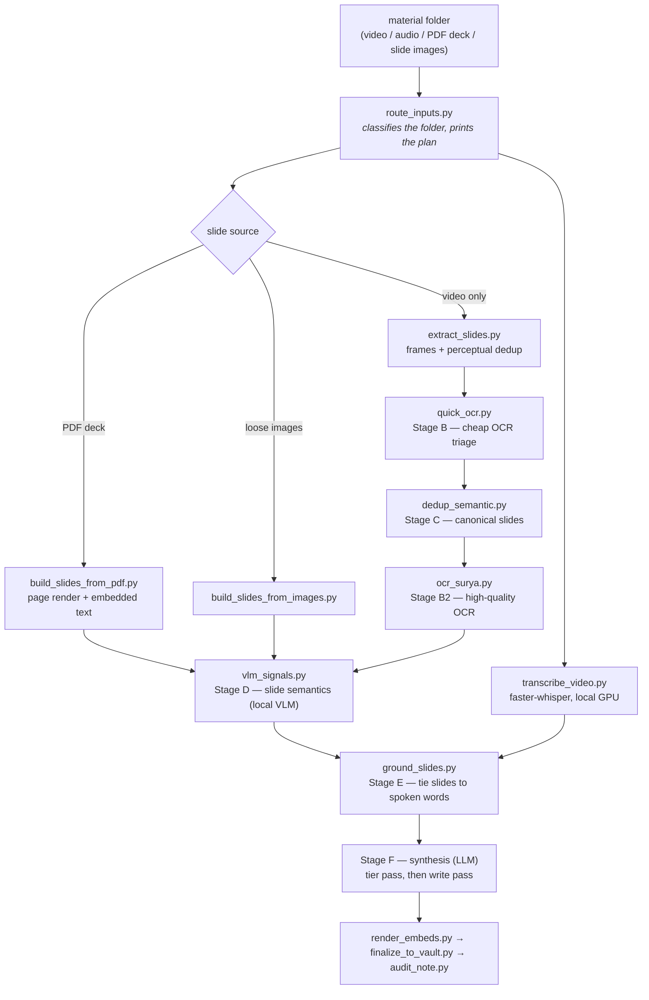

# lecture-to-notes

Turn a lecture or conference recording into structured, slide-illustrated notes.

Every expensive stage runs **locally**: Whisper ASR on your GPU, frame
extraction, OCR, and a local vision model for slide semantics. An LLM is used
only at the end, to write prose from evidence the pipeline already assembled.

The design goal is not "summarize a video". It is **traceability**: every claim
in the finished note should be attachable to a moment in the transcript and to
the slide that was on screen at that moment. Most of the machinery here exists
to make that link trustworthy rather than plausible.

---

## What it does



Stages A–E are plain Python and cost zero LLM tokens. They produce
`slides_grounded.json`: for each canonical slide, its OCR text, its semantic
signals, and the transcript segments spoken while it was on screen. That file is
the input to synthesis, and it is also readable on its own — if you never run
Stage F you still have a transcript, a deduplicated slide set, and the mapping
between them.

## Alignment: capture time is a hypothesis, cross-correlation is evidence

The part worth stealing, if you take nothing else.

When a talk is captured by more than one device — a room recording plus phone
clips plus photos — you need a shared timeline. The obvious approach is to trust
each file's capture timestamp. That approach is wrong often enough to matter:
phone clocks drift, some files only have an mtime, and a recording that was
stopped and restarted lies about its own start.

So this pipeline separates the two:

- **`media_capture_index.py`** reads capture times and emits them as *claims*,
  each with a `reliable` flag. A source whose start came from mtime, or has no
  start at all, is marked unreliable and must not be aligned on.
- **`xcorr_media_offsets.py`** measures the actual offset by cross-correlating
  transcripts of the overlapping audio. That is evidence.
- When claim and measurement disagree by more than 5 seconds, the pipeline sets
  `"conflict": true` and **stops**. It never auto-corrects.

The failure this prevents is a 44-minute misalignment that looks completely
normal in the output, because every downstream stage faithfully processes the
wrong pairing. A pipeline that silently reconciles conflicting evidence produces
confident garbage; one that flags the conflict produces a question.

## Requirements

Honest version:

- **Tested on Windows 11** with an NVIDIA RTX 3070 Ti (8 GB). Nothing is
  Windows-specific by design, but Linux/macOS are untested.
- **Python 3.12**
- **NVIDIA GPU, 8 GB+ recommended.** It runs on CPU; a 60-minute lecture then
  takes hours instead of minutes.
- **`ffmpeg` and `ffprobe` on PATH** — not optional.
- Optional: [ollama](https://ollama.com) with `minicpm-v:8b` for Stage D slide
  semantics; a separate venv with [Surya](https://github.com/VikParuchuri/surya)
  for high-quality OCR; `pandoc` for the web/PDF export.

On an 8 GB card, GPU stages must be serialized — Whisper and the VLM cannot run
concurrently, and frame extraction must not run during transcription. The
measured sweet spot for transcription is `--batch-size 3 --beam-size 10`;
`--beam-size 15` with sequential mode crashes.

## Quickstart

```bash
git clone https://github.com/drpwchen/lecture-to-notes
cd lecture-to-notes

pip install -r requirements.txt
pip install -r requirements-optional.txt     # recommended
cp config.example.yaml config.yaml           # every value is blank/optional by default

ollama pull minicpm-v:8b                     # optional, Stage D

# Put your material in one folder, then ask what to run:
python scripts/route_inputs.py /path/to/material_folder
```

`route_inputs.py` is the front door. It classifies the folder, prints the ordered
commands for the right path, and lists the questions a human has to answer
first. **It is plan-only** — it never runs anything and never writes a file.

Then run the printed commands. The first one is transcription, and it will not
start without `--lang`:

```bash
python scripts/transcribe_video.py "lecture.mp4" \
    --output-dir "$OUT_DIR" --lang <zh|en|bilingual|auto> \
    --batch-size 3 --beam-size 10
```

That is deliberate. There is no default language, because guessing wrong makes
Whisper hallucinate fluent Chinese out of accented English and the transcript is
unusable in a way that is not obvious until you read it.

## Is this a Claude Code skill or a set of scripts?

Both, and the distinction matters for what you get.

The repo is laid out as a [Claude Code](https://claude.com/claude-code) skill:
`SKILL.md` is the agent-facing map, and `reference/` holds the detailed specs the
agent reads on demand. Drop the tree into `~/.claude/skills/lecture-to-notes/`
and an agent can drive the whole thing.

**As plain CLI scripts, Stages 0–E work standalone** and give you the transcript,
the canonical slide set, the OCR text, the VLM signals, and the grounding map.
That is most of the value and all of the local compute.

**Stage F — synthesis — is prompt-driven.** It is a specification (in
`reference/note-spec.md`) for what a competent writer should do with
`slides_grounded.json`, not a script that calls an API. There is no
`synthesize.py` you can run. If you are not using an agent driver, treat
`slides_grounded.json` as the handoff point and write your own Stage F against
whatever model you prefer — the spec tells you what the output has to satisfy,
and `audit_note.py` mechanically checks it.

## Repo layout

| Path | What is in it |
|---|---|
| `SKILL.md` | The map: hard rules, the numbered pipeline, edge cases |
| `reference/pipeline.md` | Per-stage flags, thresholds, JSON schemas, timeouts |
| `reference/note-spec.md` | Output note spec, slide tier scoring, synthesis prompt requirements |
| `reference/segmented-mode.md` | Multi-talk workshop folders → per-segment notes + hub |
| `reference/multi-camera.md` | One recording + many clips/photos → one timeline |
| `reference/decisions.md` | Post-mortems, benchmarks, wrong turns, VRAM measurements |
| `scripts/` | The pipeline (see `SKILL.md` for what each stage does) |
| `scripts/batch/` | Generic batch layer: segment splitting, language detection, caching |
| `scripts/layout2/` | Web viewer assets for `export_web.py` |
| `ocr_bench/` | OCR engine A/B/C harness — bring your own fixtures |
| `data/` | Word/acronym frequency lists used to flag suspect ASR tokens |
| `docs/AUDIT_SUMMARY.md` | What the pre-release audit found, and two things it got wrong |
| `tools/sync_from_skill.py` | Maintenance: re-export from the upstream skill tree |

## Design notes worth knowing before you change something

- **The transcript is never auto-corrected.** Suspect tokens are *flagged*
  (`asr_suspects.txt`); the transcript stays byte-identical. Two auto-correction
  passes were built, measured, and retired — details in
  `reference/decisions.md`. Treat each flag as a question, not a substitution.
- **The VLM does not do OCR.** Stage D asks a vision model for semantic signals
  only (what kind of slide is this, how complex, what is it about). Text comes
  from the OCR stages. Conflating the two was the source of a long-running "we
  have three duplicate OCR scripts" confusion.
- **Optional dependencies degrade loudly.** A missing optional package disables
  its feature and tells you what you lost. It never silently substitutes a worse
  method — that produced wrong output rather than less output, which is the
  single most expensive bug class in `docs/AUDIT_SUMMARY.md`.
- **Every stage output is a superset of the previous one**, so you can re-run one
  stage without redoing transcription or frame extraction. Keep the
  intermediates; they are how tier decisions get debugged.

## Provenance and defaults

This was extracted from a personal note-taking pipeline built for physical
medicine and rehabilitation lectures, and some defaults still show it: the
example config's dedup token list targets Mandarin-language Zoom UI chrome,
the note templates use Traditional Chinese section headings, and the shipped
word lists lean medical. All of it is config, not code — see
`config.example.yaml` and `reference/note-spec.md`.

The two files in `data/` are frequency lists of ordinary dictionary words and
acronyms compiled from a local reference corpus, used only to decide whether an
ASR token looks like a real word. Regenerate them from your own corpus with
`scripts/build_real_words.py` if you want lists tuned to your domain.

## License

MIT — see [LICENSE](LICENSE).

---

# 繁體中文說明

把演講／研討會錄影變成有投影片、可回溯的結構化筆記。

重的階段全部在本機跑：Whisper 轉錄、抽幀、OCR、本地視覺模型判讀投影片語意。
LLM 只在最後一步負責寫，而且只能根據前面產生的證據寫。

設計目標不是「摘要一支影片」，而是**可回溯**：筆記裡每一句話都應該能指回逐字稿
的某個時間點，以及當下螢幕上的那張投影片。這裡大部分的機制都是為了讓這條連結
「可信」而不只是「看起來合理」。

## 環境需求

- Windows 11 實測（NVIDIA RTX 3070 Ti 8GB）。Linux/macOS 理論上可行但未測。
- Python 3.12、`ffmpeg` 與 `ffprobe` 必須在 PATH。
- 建議 NVIDIA GPU 8GB 以上；純 CPU 可跑，但一小時的課會從幾分鐘變成幾小時。
- 選配：ollama + `minicpm-v:8b`（Stage D）、獨立 venv 的 Surya（高品質 OCR）、
  pandoc（網頁／PDF 匯出）。
- 8GB 顯卡上 GPU 階段必須序列化：Whisper 和 VLM 不能同時跑，抽幀也不能和轉錄
  搶卡。轉錄實測甜蜜點是 `--batch-size 3 --beam-size 10`。

## 快速開始

```bash
pip install -r requirements.txt
pip install -r requirements-optional.txt
cp config.example.yaml config.yaml

python scripts/route_inputs.py /path/to/素材資料夾
```

`route_inputs.py` 是唯一入口：它判斷資料夾內容、印出該走哪條路線的完整指令，
並列出需要人先回答的問題。==它只規劃、不執行、不寫檔==。

轉錄一定要給 `--lang`，沒有預設值。語言猜錯的話 Whisper 會把有口音的英文幻覺成
流暢的中文，而且要等你讀了逐字稿才會發現。

## 三個要先知道的設計

- ==逐字稿永不自動修正==。可疑詞只會被「標記」到 `asr_suspects.txt`，逐字稿本身
  一個 byte 都不動。兩版自動修正都做過、量測過、然後撤掉了
  （`reference/decisions.md`）。
- ==VLM 不做 OCR==。Stage D 只問視覺模型語意訊號，文字一律來自 OCR 階段。
- ==選配套件缺了要吵==。缺套件就關掉該功能並講清楚少了什麼，絕不偷偷換一個比較
  差的方法——「輸出變錯」比「輸出變少」貴太多，細節見 `docs/AUDIT_SUMMARY.md`。

## 多來源對齊：拍攝時間是假設，交叉相關是證據

一場演講如果同時有主錄影、手機側錄和照片，需要一條共同時間軸。直覺做法是相信
每個檔案的拍攝時間戳——但手機時鐘會漂、有些檔案只剩 mtime、中途停過再開的錄影
會謊報自己的起點。

所以這裡把兩件事分開：`media_capture_index.py` 只產生「宣稱」（附 `reliable`
旗標，不可靠的來源不准拿來對齊），`xcorr_media_offsets.py` 用重疊音訊的逐字稿
交叉相關「量測」實際偏移。兩者差超過 5 秒就標 `"conflict": true` 交給人判斷，
==絕不自動修正==。這擋掉的是那種 44 分鐘錯位、但輸出看起來完全正常的災難。

## 這是 skill 還是一堆腳本？

兩者都是。目錄結構是 Claude Code skill（`SKILL.md` 是給 agent 讀的地圖，
`reference/` 是細節），丟進 `~/.claude/skills/` 就能讓 agent 全程驅動。

當成純 CLI 用的話，Stage 0–E 都能單獨跑，會給你逐字稿、去重後的投影片、OCR
文字、VLM 訊號，以及兩者的對應表——這是大部分的價值。但 ==Stage F 合成是
prompt 驅動的規格（`reference/note-spec.md`），不是可執行腳本==，沒有
`synthesize.py`。不用 agent 的話，請把 `slides_grounded.json` 當交接點，自己接
想用的模型；規格說明產物要滿足什麼條件，`audit_note.py` 會機械化檢查。

## 出身

這是從一套個人筆記管線（復健科演講）抽出來的，預設值還看得出來歷：dedup 的
UI 雜訊字典針對中文 Zoom、筆記模板用繁中標題、字表偏醫學。這些全都是 config
不是 code，見 `config.example.yaml` 與 `reference/note-spec.md`。

授權 MIT。
