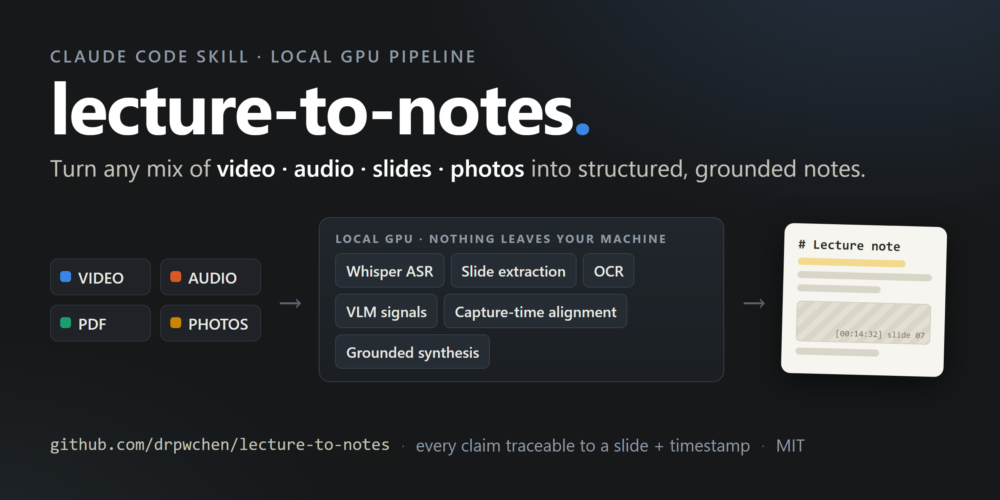
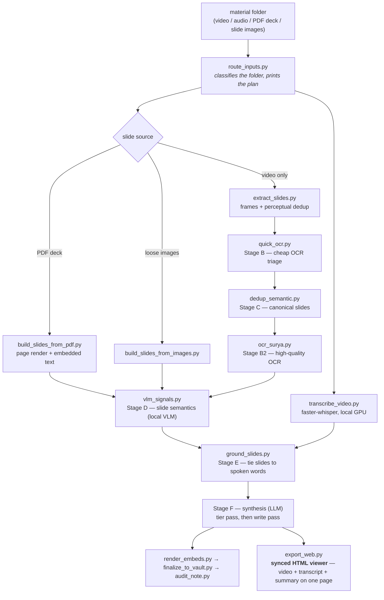
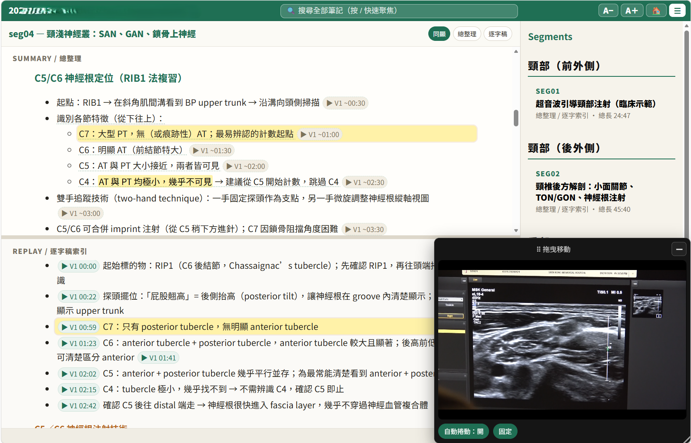
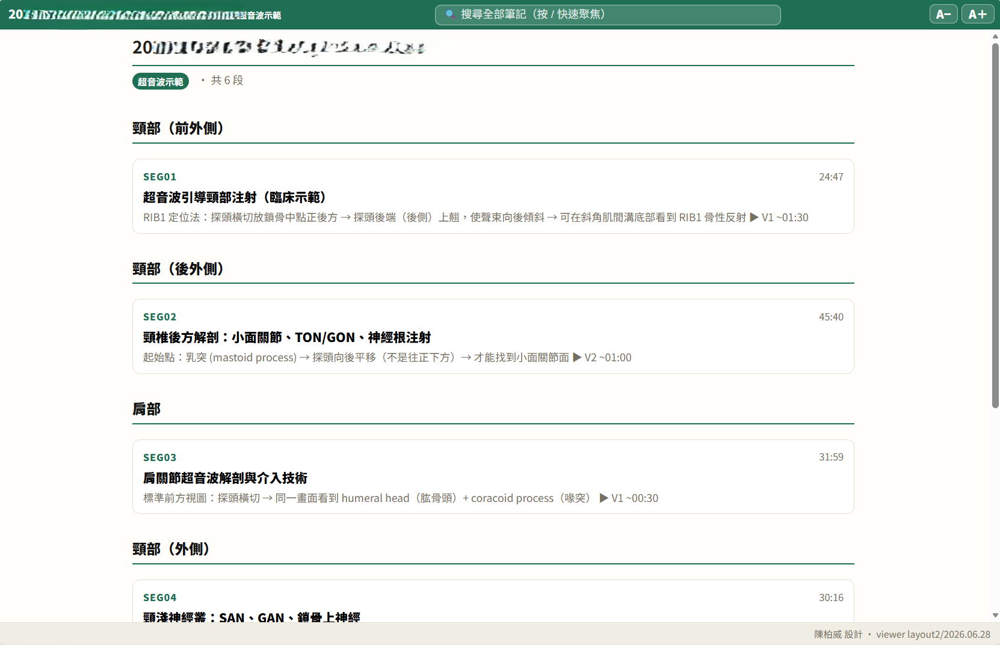
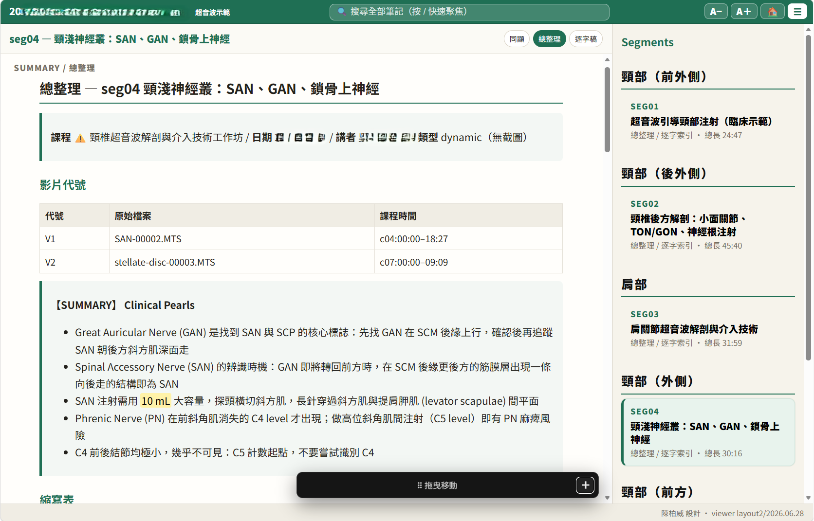

# lecture-to-notes

[](https://github.com/drpwchen/lecture-to-notes/actions/workflows/secret-scan.yml)

**English** · [繁體中文](README.zh-TW.md)



Turn a lecture or conference recording into structured, slide-illustrated notes —
and into a **synced HTML viewer** where the video, the timestamped transcript,
and the curated summary sit on one page: the video highlights the matching note
as it plays, and clicking any note timestamp seeks the video.

Every expensive stage runs **locally**: Whisper ASR on your GPU, frame
extraction, OCR, and a local vision model for slide semantics. An LLM is used
only at the end, to write prose from evidence the pipeline already assembled.

The design goal is not "summarize a video". It is **traceability**: every claim
in the finished note should be attachable to a moment in the transcript and to
the slide that was on screen at that moment. Most of the machinery here exists
to make that link trustworthy rather than plausible.

## Why this exists

Rehabilitation-medicine courses are notoriously hard to take notes on. Manual
therapy, ultrasound scanning — the knowledge is in the *motion*, so at every
course you see a forest of tripods: everyone records everything, planning to
rewatch over dinner. Nobody actually rewatches hours of video.

With AI the first instinct was to teach it precise screenshotting, to squeeze
the video back into a traditional text-plus-figures note. The turn was realizing
a note doesn't have to be that shape at all: build a webpage that ties the video
to the transcript, and you can jump straight to the moment you care about. What
you actually want to know is *how the maneuver is performed* — and that only
lives in motion. So the summary is for studying, the transcript is for
verifying, and the video is one click away from both.

## Bring whatever you captured

Real courses never produce one tidy recording. Some talks you filmed, some you
only audio-recorded, for some you photographed the slides with your phone, and
sometimes the organizer hands out a PDF deck afterwards. This pipeline takes
the folder **as-is**: `route_inputs.py` figures out what role each file plays,
and the alignment stage stitches every source onto **one shared timeline** —
so the finished note cites the right slide at the right moment even when that
slide never appeared inside the video.

---

## What it does



Stages A–E are plain Python and cost zero LLM tokens. They produce
`slides_grounded.json`: for each canonical slide, its OCR text, its semantic
signals, and the transcript segments spoken while it was on screen. That file is
the input to synthesis, and it is also readable on its own — if you never run
Stage F you still have a transcript, a deduplicated slide set, and the mapping
between them.

## The HTML viewer: video, transcript and summary on one page

The signature output. `export_web.py` builds a **single self-contained HTML
page** per course where the video, the timestamped transcript, and the curated
summary notes are presented **together and kept in sync both ways**:

- **Video → notes**: as the video plays, the matching note bullet
  auto-highlights and scrolls into view.
- **Notes → video**: every bullet carries a `(Vn MM:SS)` timestamp — click it
  and the video seeks to that moment.
- **Three read modes**: summary only, transcript only, or both side by side —
  the summary layer (curated, workflow-ordered) and the transcript layer
  (verbatim, time-ordered) are separate chapters of the same timeline, so you
  can study top-down and verify bottom-up without leaving the page.
- **Resizable panes, sidebar segment navigation**, slide images inline where
  they were shown.
- **Offline and shareable**: one `.html` plus one support folder (browser-ready
  clips, friendly-named slides, markdown + PDF copies). No server, no build
  step for the reader — send the folder, they double-click the page.
  `--compress` produces a smaller H.264 set for handing around.

Real output from a cervical-ultrasound workshop (dates and speaker names
blurred):



| Course hub — every segment with duration and a one-line hook | Summary view — per-video source table and key pearls |
|---|---|
|  |  |

The viewer UI lives in `scripts/layout2/` (`viewer.css`, `viewer.js`);
`export_web.py` only generates the per-course timeline manifest and the synced
note HTML, so a UI tweak is an asset edit, not a generator change.

## Markdown notes for your vault

The HTML viewer is the reading surface; **plain markdown is the storage
format**, so everything also lands in your note vault:

- `finalize_to_vault.py` ships the finished note plus its cited slide images
  into an Obsidian-style vault (attachment folder and inbox are configurable
  flags — any folder of markdown works).
- The viewer's support folder contains a `markdown/` copy of every transcript
  and summary, wikilink-rewritten so the folder itself **opens directly as an
  Obsidian vault** — same content as the webpage, readable and searchable in
  your normal note workflow, plus PDF copies for people who want neither.

So you get three durable forms of the same lecture: the synced webpage for
studying, markdown for your knowledge base, PDF for handing to anyone.

## Alignment: capture time is a hypothesis, cross-correlation is evidence

The part worth stealing, if you take nothing else.

When a talk is captured by more than one device — a room recording plus phone
clips plus photos — you need a shared timeline. The obvious approach is to trust
each file's capture timestamp. That approach is wrong often enough to matter:
phone clocks drift, some files only have an mtime, and a recording that was
stopped and restarted lies about its own start.

So this pipeline separates the two:

- **`media_capture_index.py`** reads capture times and emits them as *claims*,
  each with a `reliable` flag. A source whose start came from mtime, or has no
  start at all, is marked unreliable and must not be aligned on.
- **`xcorr_media_offsets.py`** measures the actual offset by cross-correlating
  transcripts of the overlapping audio. That is evidence.
- When claim and measurement disagree by more than 5 seconds, the pipeline sets
  `"conflict": true` and **stops**. It never auto-corrects.

The failure this prevents is a 44-minute misalignment that looks completely
normal in the output, because every downstream stage faithfully processes the
wrong pairing. A pipeline that silently reconciles conflicting evidence produces
confident garbage; one that flags the conflict produces a question.

## Requirements

Honest version:

- **Tested on Windows 11** with an NVIDIA RTX 3070 Ti (8 GB). Nothing is
  Windows-specific by design, but Linux/macOS are untested.
- **Python 3.12**
- **An NVIDIA GPU (8 GB+) is the fast path, not a requirement.** Without one:
  - **CPU fallback is built in** — transcription drops to int8 on CPU
    automatically and prints an honest ETA first (a 60-minute lecture takes
    hours instead of minutes). The OCR triage stage is CPU-friendly already.
  - **Offload transcription to a hosted Whisper** — `scripts/groq_asr.py`
    sends compressed audio to Groq's `whisper-large-v3-turbo` (free tier
    works; the 25 MB request cap is handled by chunking) and returns the same
    segment format as the local path. Read its docstring first: hosted Whisper
    has no anti-collapse knobs for heavily code-switched audio, and anything
    you send leaves your machine — don't route confidential recordings there.
  - **Apple Silicon** should work in CPU mode (faster-whisper on CPU, ollama
    is native on macOS) — plausible but untested; reports welcome.
- **`ffmpeg` and `ffprobe` on PATH** — not optional.
- Optional: [ollama](https://ollama.com) with `minicpm-v:8b` for Stage D slide
  semantics; a separate venv with [Surya](https://github.com/VikParuchuri/surya)
  for high-quality OCR; `pandoc` for the web/PDF export.

On an 8 GB card, GPU stages must be serialized — Whisper and the VLM cannot run
concurrently, and frame extraction must not run during transcription. The
measured sweet spot for transcription is `--batch-size 3 --beam-size 10`;
`--beam-size 15` with sequential mode crashes.

## Quickstart

```bash
git clone https://github.com/drpwchen/lecture-to-notes
cd lecture-to-notes

pip install -r requirements.txt
pip install -r requirements-optional.txt     # recommended
cp config.example.yaml config.yaml           # every value is blank/optional by default

ollama pull minicpm-v:8b                     # optional, Stage D

# Put your material in one folder, then ask what to run:
python scripts/route_inputs.py /path/to/material_folder
```

`route_inputs.py` is the front door. It classifies the folder, prints the ordered
commands for the right path, and lists the questions a human has to answer
first. **It is plan-only** — it never runs anything and never writes a file.

Then run the printed commands. The first one is transcription, and it will not
start without `--lang`:

```bash
python scripts/transcribe_video.py "lecture.mp4" \
    --output-dir "$OUT_DIR" --lang <zh|en|bilingual|auto> \
    --batch-size 3 --beam-size 10
```

That is deliberate. There is no default language, because guessing wrong makes
Whisper hallucinate fluent Chinese out of accented English and the transcript is
unusable in a way that is not obvious until you read it.

## Is this a Claude Code skill or a set of scripts?

Both, and the distinction matters for what you get.

The repo is laid out as a [Claude Code](https://claude.com/claude-code) skill:
`SKILL.md` is the agent-facing map, and `reference/` holds the detailed specs the
agent reads on demand. Drop the tree into `~/.claude/skills/lecture-to-notes/`
and an agent can drive the whole thing.

**As plain CLI scripts, Stages 0–E work standalone** and give you the transcript,
the canonical slide set, the OCR text, the VLM signals, and the grounding map.
That is most of the value and all of the local compute.

**Stage F — synthesis — is prompt-driven.** It is a specification (in
`reference/note-spec.md`) for what a competent writer should do with
`slides_grounded.json`, not a script that calls an API. There is no
`synthesize.py` you can run. If you are not using an agent driver, treat
`slides_grounded.json` as the handoff point and write your own Stage F against
whatever model you prefer — the spec tells you what the output has to satisfy,
and `audit_note.py` mechanically checks it.

## Repo layout

| Path | What is in it |
|---|---|
| `SKILL.md` | The map: hard rules, the numbered pipeline, edge cases |
| `reference/pipeline.md` | Per-stage flags, thresholds, JSON schemas, timeouts |
| `reference/note-spec.md` | Output note spec, slide tier scoring, synthesis prompt requirements |
| `reference/segmented-mode.md` | Multi-talk workshop folders → per-segment notes + hub |
| `reference/multi-camera.md` | One recording + many clips/photos → one timeline |
| `reference/decisions.md` | Post-mortems, benchmarks, wrong turns, VRAM measurements |
| `scripts/` | The pipeline (see `SKILL.md` for what each stage does) |
| `scripts/batch/` | Generic batch layer: segment splitting, language detection, caching |
| `scripts/layout2/` | Web viewer assets for `export_web.py` |
| `ocr_bench/` | OCR engine A/B/C harness — bring your own fixtures |
| `data/` | Word/acronym frequency lists used to flag suspect ASR tokens |
| `docs/AUDIT_SUMMARY.md` | What the pre-release audit found, and two things it got wrong |
| `tools/sync_from_skill.py` | Maintenance: re-export from the upstream skill tree |

## Design notes worth knowing before you change something

- **The transcript is never auto-corrected.** Suspect tokens are *flagged*
  (`asr_suspects.txt`); the transcript stays byte-identical. Two auto-correction
  passes were built, measured, and retired — details in
  `reference/decisions.md`. Treat each flag as a question, not a substitution.
- **The VLM does not do OCR.** Stage D asks a vision model for semantic signals
  only (what kind of slide is this, how complex, what is it about). Text comes
  from the OCR stages. Conflating the two was the source of a long-running "we
  have three duplicate OCR scripts" confusion.
- **Optional dependencies degrade loudly.** A missing optional package disables
  its feature and tells you what you lost. It never silently substitutes a worse
  method — that produced wrong output rather than less output, which is the
  single most expensive bug class in `docs/AUDIT_SUMMARY.md`.
- **Every stage output is a superset of the previous one**, so you can re-run one
  stage without redoing transcription or frame extraction. Keep the
  intermediates; they are how tier decisions get debugged.

## Provenance and defaults

This was extracted from a personal note-taking pipeline built for physical
medicine and rehabilitation lectures, and some defaults still show it: the
example config's dedup token list targets Mandarin-language Zoom UI chrome,
the note templates use Traditional Chinese section headings, and the shipped
word lists lean medical. All of it is config, not code — see
`config.example.yaml` and `reference/note-spec.md`.

The two files in `data/` are frequency lists of ordinary dictionary words and
acronyms compiled from a local reference corpus, used only to decide whether an
ASR token looks like a real word. Regenerate them from your own corpus with
`scripts/build_real_words.py` if you want lists tuned to your domain.

## 🌱 Start here if you're new to AI agents

This pipeline is one piece of my personal AI workflow. If you want to learn how
to use AI agents like Claude Code from zero (no programming background needed),
I wrote a beginner series (in Traditional Chinese):

1. [從零開始：安裝、看懂 GitHub、跑起你的第一個工具](https://drpwchen.com/posts/getting-started/)
2. [怎麼跟 AI agent 講話：心法、元技能與規則檔](https://drpwchen.com/posts/talking-to-agents/)
3. [自動化流程不是設計出來的，是長出來的](https://drpwchen.com/posts/growing-your-workflow/)

The story behind this particular tool →
[演講影片變成筆記：本機 GPU 轉錄 + 投影片對位](https://drpwchen.com/posts/lecture-to-notes/)

Full map of my tools and posts → [drpwchen.com/map](https://drpwchen.com/map/)

## License

MIT — see [LICENSE](LICENSE).

## Support 支持

覺得這個工具有幫助嗎？歡迎[請我喝飲料](https://drpwchen.com/support/) 🧋
If this tool helped you, you can [buy me a drink](https://drpwchen.com/en/support/).
