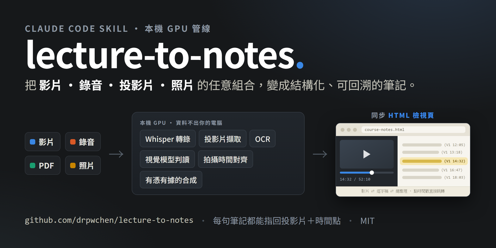

# lecture-to-notes

[](https://github.com/drpwchen/lecture-to-notes/actions/workflows/secret-scan.yml)

[English](README.md) · **繁體中文**



把演講／研討會錄影變成有投影片、可回溯的結構化筆記，並輸出招牌的
**同步 HTML 檢視頁**：影片、逐字稿、總整理在同一頁呈現——影片播到哪，
對應筆記自動高亮捲動；點筆記上的 `(Vn MM:SS)` 時間戳，影片直接跳到那一刻。

重的階段全部在本機跑：Whisper 轉錄、抽幀、OCR、本地視覺模型判讀投影片語意。
LLM 只在最後一步負責寫，而且只能根據前面產生的證據寫。

設計目標不是「摘要一支影片」，而是**可回溯**：筆記裡每一句話都應該能指回逐字稿
的某個時間點，以及當下螢幕上的那張投影片。這裡大部分的機制都是為了讓這條連結
「可信」而不只是「看起來合理」。

## 起心動念

從以前就覺得復健科的課程很難做筆記——特別是徒手治療、超音波影像這種，知識
藏在「動作」裡，要有影片才學得起來。所以很多復健科的課，現場都是滿滿的腳架，
大家錄回去打算配飯複習。但實際上，幾小時的影片根本不會回去看完。

有了 AI 之後，原本的思路是教它精準截圖，把影片塞回傳統「文字＋圖片」的筆記
形式。後來想通了：筆記不必拘泥於那個形狀。直接做成一個網頁，把影片跟逐字稿
對上，想看哪段就跳到哪段——畢竟真正想知道的，是動態下到底怎麼操作！於是變成
現在的形式：總整理拿來讀、逐字稿拿來驗證、影片永遠在一鍵之外。

## 手上有什麼就帶什麼來

真實的課程從來不會只有一支乾淨的錄影：有的講題你錄了影、有的只錄到音、
有的只用手機拍了投影片，會後主辦單位又補發一份 PDF 講義。這條管線把資料夾
**原樣**吃進去：`route_inputs.py` 判斷每個檔案扮演什麼角色，對齊階段再把所有
來源接上**同一條時間軸**——就算某張投影片從頭到尾沒出現在影片畫面裡，
筆記引用到它的那一刻仍然指得回正確的時間點。

## 同步 HTML 檢視頁：影片、逐字稿、總整理同一頁

招牌輸出。`export_web.py` 為每門課產生**單一自包含 HTML 頁**，三樣東西雙向同步：

- **影片 → 筆記**：影片播放時，對應的筆記條目自動高亮並捲動到可見位置。
- **筆記 → 影片**：每條筆記都帶 `(Vn MM:SS)` 時間戳，點下去影片直接跳轉。
- **三種閱讀模式**：只看總整理、只看逐字稿、或並排對照——總整理層（策展過、
  按臨床流程排）和逐字稿層（逐字、按時間排）是同一條時間軸的兩章，
  由上而下讀、由下而上驗證，不用離開頁面。
- **可拉動的分割面板、側欄段落導覽**，投影片圖就嵌在它出現的位置。
- **離線可分享**：一個 `.html` 加一個素材資料夾（瀏覽器可播的影片、
  友善命名的投影片、markdown 與 PDF 副本）。不用架伺服器，把資料夾傳給
  對方，點兩下就能看。`--compress` 可產生較小的 H.264 分享包。

實際輸出（一場頸椎超音波工作坊；日期與講者已馬賽克）：


| 課程首頁——每段的長度與一句話重點 | 總整理頁——影片代號表與臨床 pearls |
|---|---|
|  |  |

檢視頁的 UI 在 `scripts/layout2/`（`viewer.css`、`viewer.js`）；
`export_web.py` 只負責產生時間軸 manifest 和同步筆記 HTML——改 UI 是改資產檔，
不是改產生器。

## Markdown 輸出：放進你的筆記庫

HTML 檢視頁是閱讀介面；**markdown 才是儲存格式**，所有內容也會以純文字落地：

- `finalize_to_vault.py` 把完成的筆記連同引用的投影片圖，直接歸檔進
  Obsidian 式筆記庫（附件資料夾與收件匣位置都是可設定的 flag，
  任何放 markdown 的資料夾都行）。
- 檢視頁的素材資料夾裡有 `markdown/`，收錄每段逐字稿與總整理的副本，
  wikilink 都改寫好了——**整個資料夾直接當 Obsidian vault 打開**，
  跟網頁同一份內容，在你平常的筆記流程裡可讀可搜。另附 PDF 副本。

所以同一堂課會有三種耐放的形態：同步網頁拿來研讀、markdown 進知識庫、
PDF 給誰都能開。

## 管線做了什麼

Stage A–E 是純 Python、零 LLM token：轉錄（faster-whisper）、抽幀＋感知去重、
OCR 兩階段（RapidOCR 快篩 → Surya 精讀）、本地 VLM 判讀投影片語意、
最後把投影片跟「講到它的那段話」綁定，產出 `slides_grounded.json`。
就算不跑最後的合成，你也已經拿到逐字稿、去重後的投影片集、和兩者的對應表。

素材入口是 `python scripts/route_inputs.py <素材資料夾>`——它判斷你手上有
什麼（影片／錄音／PDF／照片的任意組合）、印出該走哪條路線的完整指令、
列出需要人先回答的問題。它只規劃、不執行、不寫檔。

## 多來源對齊：拍攝時間是假設，交叉相關是證據

一場演講如果同時有主錄影、手機側錄和照片，需要一條共同時間軸。直覺做法是相信
每個檔案的拍攝時間戳——但手機時鐘會漂、有些檔案只剩 mtime、中途停過再開的錄影
會謊報自己的起點。

所以這裡把兩件事分開：`media_capture_index.py` 只產生「宣稱」（附 `reliable`
旗標，不可靠的來源不准拿來對齊），`xcorr_media_offsets.py` 用重疊音訊的逐字稿
交叉相關「量測」實際偏移。兩者差超過 5 秒就標 `"conflict": true` 交給人判斷，
絕不自動修正。這擋掉的是那種 44 分鐘錯位、但輸出看起來完全正常的災難。

## 環境需求

- Windows 11 實測（NVIDIA RTX 3070 Ti 8GB）。Linux/macOS 理論上可行但未測。
- Python 3.12、`ffmpeg` 與 `ffprobe` 必須在 PATH。
- **NVIDIA GPU（8GB 以上）是快速路徑，不是硬需求。**沒有的話：
  - **CPU fallback 內建**——轉錄自動降到 CPU int8，開跑前先誠實印出預估時間
    （一小時的課會從幾分鐘變成幾小時）。OCR 快篩階段本來就對 CPU 友善。
  - **轉錄外包給雲端 Whisper**——`scripts/groq_asr.py` 把壓縮後的音訊送
    Groq 的 `whisper-large-v3-turbo`（免費層可用；25 MB 上限自動分段），
    回傳格式與本機路徑完全相容。先讀它的 docstring：雲端版對中英混講的
    防崩潰參數全都沒有，而且音訊會離開你的電腦——機密錄音別走這條。
  - **Apple Silicon** 理論上以 CPU 模式可行（faster-whisper 走 CPU、
    ollama 原生支援 macOS）——合理但未實測，歡迎回報。
- 選配：ollama + `minicpm-v:8b`（Stage D）、獨立 venv 的 Surya（高品質 OCR）、
  pandoc（網頁／PDF 匯出）。
- 8GB 顯卡上 GPU 階段必須序列化：Whisper 和 VLM 不能同時跑，抽幀也不能和轉錄
  搶卡。轉錄實測甜蜜點是 `--batch-size 3 --beam-size 10`。

## 快速開始

```bash
git clone https://github.com/drpwchen/lecture-to-notes
cd lecture-to-notes

pip install -r requirements.txt
pip install -r requirements-optional.txt
cp config.example.yaml config.yaml

python scripts/route_inputs.py /path/to/素材資料夾
```

照印出來的指令跑。轉錄一定要給 `--lang`，沒有預設值——語言猜錯的話 Whisper
會把有口音的英文幻覺成流暢的中文，而且要等你讀了逐字稿才會發現。

## 三個要先知道的設計

- **逐字稿永不自動修正**。可疑詞只會被「標記」到 `asr_suspects.txt`，逐字稿本身
  一個 byte 都不動。兩版自動修正都做過、量測過、然後撤掉了
  （`reference/decisions.md`）。
- **VLM 不做 OCR**。Stage D 只問視覺模型語意訊號，文字一律來自 OCR 階段。
- **選配套件缺了要吵**。缺套件就關掉該功能並講清楚少了什麼，絕不偷偷換一個比較
  差的方法——「輸出變錯」比「輸出變少」貴太多，細節見 `docs/AUDIT_SUMMARY.md`。

## 這是 skill 還是一堆腳本？

兩者都是。目錄結構是 Claude Code skill（`SKILL.md` 是給 agent 讀的地圖，
`reference/` 是細節），丟進 `~/.claude/skills/` 就能讓 agent 全程驅動。

當成純 CLI 用的話，Stage 0–E 都能單獨跑，會給你逐字稿、去重後的投影片、OCR
文字、VLM 訊號，以及兩者的對應表——這是大部分的價值。但 **Stage F 合成是
prompt 驅動的規格（`reference/note-spec.md`），不是可執行腳本**，沒有
`synthesize.py`。不用 agent 的話，請把 `slides_grounded.json` 當交接點，自己接
想用的模型；規格說明產物要滿足什麼條件，`audit_note.py` 會機械化檢查。

## 出身

這是從一套個人筆記管線（復健科演講）抽出來的，預設值還看得出來歷：dedup 的
UI 雜訊字典針對中文 Zoom、筆記模板用繁中標題、字表偏醫學。這些全都是 config
不是 code，見 `config.example.yaml` 與 `reference/note-spec.md`。

## 🌱 AI agent 新手起點

這套管線是我個人 AI 工作流的一部分。想從零開始學怎麼用 Claude Code 這類 AI
agent（不需要程式背景），可以從我的入門系列開始：

1. [從零開始：安裝、看懂 GitHub、跑起你的第一個工具](https://drpwchen.com/posts/getting-started/)
2. [怎麼跟 AI agent 講話：心法、元技能與規則檔](https://drpwchen.com/posts/talking-to-agents/)
3. [自動化流程不是設計出來的，是長出來的](https://drpwchen.com/posts/growing-your-workflow/)

這個工具本身的來龍去脈 →
[演講影片變成筆記：本機 GPU 轉錄 + 投影片對位](https://drpwchen.com/posts/lecture-to-notes/)

所有工具與文章的全貌 → [drpwchen.com/map](https://drpwchen.com/map/)

授權 MIT — 見 [LICENSE](LICENSE)。

## Support 支持

覺得這個工具有幫助嗎？歡迎[請我喝飲料](https://drpwchen.com/support/) 🧋
If this tool helped you, you can [buy me a drink](https://drpwchen.com/en/support/).
